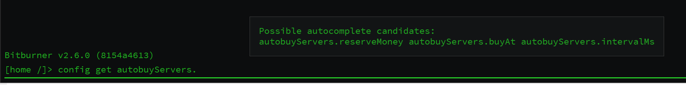

# services/Scheduler

* Code: [https://github.com/abesto/bitburner-scripts-2/tree/main/src/services/Scheduler](https://github.com/abesto/bitburner-scripts-2/tree/main/src/services/Scheduler)
* Dependencies:
  * [services-portregistry.md](services-portregistry.md "mention") and [services-stats.md](services-stats.md "mention") for reporting scheduling latency
  * [services-portregistry.md](services-portregistry.md "mention") for `SchedulerClient`
* In-game RAM: 5.55GB
* Related CLIs: [bin-sc.md](../other-binaries/bin-sc.md "mention")

<figure><figcaption></figcaption></figure>

A service-oriented architecture needs _services_ to be _running_. Bitburner in general also needs you to run a large number of in-game processes with a large number of in-game "threads". This is where it all happens.


"Threads" in Bitburner (much like ports) have not much in common with their real-life counterparts. Here's what threads are in Bitburner: a multiplier for 1. the RAM usage and 2. the power of many game-API functions like `hack`, `grow`, `weaken` and more. They don't mean any concurrency at all.


## Usage Example

```typescript
const { jobId, threads } = await schedulerClient.start({
  script: "/bin/payloads/grow.js",
  args: [host],
  threads: threadTarget,
});
// --%-- //
await schedulerClient.waitForJobFinished(jobId);
```

## Capacity Management

`Scheduler` regularly auto-nukes all hosts it can to ensure we use all available capacity. Beyond that, capacity management is fairly rudimentary: whenever we need capacity information, we look at the current real state of the world, and go from there.

There's room for (maybe in a separate service) reserving capacity for planned workloads. The trade-off is one of safety versus efficiency. Just-in-time scheduling (the current solution) uses all available capacity at any moment. In my mind this is likely the better option.

Of course the service can be queried for its current view of the world wrt. available vs. used capacity.

## Host Selection

Pretend we get to the point where we know we need to run a script with N threads. How do we pick where to run it? Here's a brief look at the current approach.

* Start with the full set of hosts where we can run scripts
* Throw away any hosts that don't have enough free RAM to run even a single thread of the script
* Randomly shuffle the list of hosts
* Bring hosts to the front that have enough memory to run all requested threads, and between them, bring forward even more those hosts that have the least free memory ("best fit")
* Each request to run things may optionally contain a `HostAffinity`. This can either say that the process _prefers_ to run on a host, or that it _must_ run on a host. Apply this: drop other hosts if it _must_ run on one, or bring to the front of the list those that it prefers.

From here, we schedule as many threads as we can on the first host in the list, move on to the next, and repeat until we've scheduled all requested threads, or we're out of capacity. This is not optimal, but it's been Good Enough for me.

## Workload Management

One important thing the `Scheduler` schedules is processes with vast amounts of threads across any number of hosts. Think about when you want to `grow` or `weaken` or `hack` a server. You can submit a request to the `Scheduler` to run 20k `grow` jobs with a given (host) argument, and let it take care of the rest.

In this part of the Scheduler, we have two concepts: Jobs and Tasks. A Job is one workload submitted by a client; 20k `grow` threads in our example. This job may have one or many Tasks. Each task represents one process running on a host (with some number of threads).

Such workloads are submitted using the `SchedulerRequest.start` request. The response to such a request includes the number of threads that were successfully started; this may be zero! It's up to the client to check this and figure out what to do about it.

The scheduler periodically checks whether tasks that _should_ be running are still running, and considers them finished if they've stopped. However, this should only happen rarely if ever: the scheduler accepts `SchedulerRequest.taskFinished` for workloads to report that they're done. How does the scheduler know which task is done? It injects `--job <job-id> --task <task-id>` arguments into the argument list of each process it starts. The client can look at these values, and use them to report back. In practice, this looks something like this:

```typescript
await new NoResponseSchedulerClient(ns, log).taskFinished(jobId, taskId);
```

Note the `NoResponse` prefix on the client class; this just means that requests on this client will never have a response. This separation is useful to allow more powerful abstract client classes.

The scheduler exposes APIs to start and stop jobs, and to query information about running jobs/tasks.

## Process Trees

Bitburner has no native support for process trees. As in: if you start a process, and it dies, you'll never know unless you check. Conversely, if you start a process and _you_ die (the process that started the other process I mean), then the child process keeps running like nothing in the world is wrong.

`Scheduler` improves this situation also.

### Notify Parent About Child

When you submit a `SchedulerRequest.start` request, by default you'll get a notification on the `responsePort` of the same client when the process is done. This is how the example at the top of the page works. You can also override the notification port with either `null` to disable notifications, or even with a custom port, if you want to separate out notifications from other responses. This can be useful as each port is a queue, and you must consume each item on it before you can look at the next.

Here's a bigger example including a custom notification port and a host affinity:

```typescript
      const { jobId } = await schedulerClient.start(
        {
          script: "/bin/hwgw-batch.js",
          args,
          threads: 1,
          hostAffinity: HostAffinity.preferToRunOn({ host: "home" }),
        },
        {
          finishNotificationPort: jobFinishedPortNumber,
        }
      );
```

### Kill Children on Parent Exit

The `Scheduler` also cleans up after you: if a parent process exits before its children, the scheduler will kill the child processes.

How does it know which processes to kill? Magic! More specifically: `SchedulerClient` has code to inspect `ns.args` for the `job` and `task` flags the scheduler injects into the args lists of processes started by the scheduler. These are then passed in the `start` request to the scheduler in the `parent` field of the job spec. The scheduler does some book-keeping, and boom, well-behaved process trees!

Unfortunately this only works when the parent process is started by the scheduler. Luckily it's easy to migrate a process started in another way into the scheduler:

```typescript
  if (!args.job || args.task < 0) {
    const resp = await schedulerClient.start(
      {
        script: "/bin/hwgw-controller.js",
        args: ns.args.map((arg) => arg.toString()),
        threads: 1,
        hostAffinity: HostAffinity.mustRunOn({ host: "home" }),
      },
      { nohup: true }
    );
    if (resp.threads === 0) {
      log.terror("Failed to start job", { resp });
    } else {
      log.tinfo("Migrated into Scheduler", { resp });
    }
    return;
  }
```

Note the `nohup` option; that just means: don't shut down the process you're about to start even when I exit (not that you could realize I exited, but don't even try please)

## Service Management

The other kind of "thing" you want the Scheduler to manage (besides workloads like `grow`) is other services.

First off, the scheduler must know that a service exists. The list of services, and some metadata about them, is stored in the source tree (and consequently deployed into the game) in `bin/services/specs.json.txt`. It looks something like this:

```json
{
  "PortRegistry": {
    "enableWhenDiscovered": true
  },
  "BuyWorkers": {},
  "Database": {
    "enableWhenDiscovered": true,
    "hostAffinity": {
      "type": "mustRunOn",
      "host": "home"
    }
  },
  [...]
}
```

"Enabled" here means the same thing it means in Systemd: should the scheduler start this service at boot? And should it restart it, should the service crash?

Scheduler exposes APIs to start, stop, enable, and disable services, to reload the above spec file, and to query the state (including logs) of an individual service. Here's a screenshot of what happens when I bully it a bit. Don't worry, it won't get offended.

<figure><figcaption></figcaption></figure>

